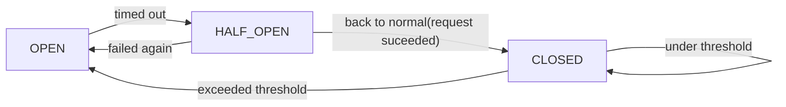

# 서킷 브레이커

## 1. 개요
네트워크 통신에서 효율적으로 리소스를 활용하기 위해 재시도 전략은 효과적일 수 있습니다. 허나, 
이런경우는 어떻게 해야할까요? 하나의 어플리케이션에서 외부로 연계하는 독립적인 서비스가 3개 있고,
이 각각의 서비스는 재시도전략을 사용하고 있다고 가정해보겠습니다. 한 서비스가 외부 요인으로
병목현상이 발생하게 되면 다른서비스도 덩달아 병목현상이 발생하게 될 것입니다. 그럼 장애가 전파되지
않도록 하려면 어떻게 해야할까요? 이럴 때 적용할 수 있는 개념이 장애 허용 시스템입니다.

> 장애 허용 시스템(Fault Tolerant System, FTS)은 하드웨어나 소프트웨어 시스템에서 결함,
> 장애가 발생하여도 정상적인 운영할 수 있도록 만든 시스템입니다. 장애 허용 개념이 고려되지 않은
> 일반 시스템에서는 부품에서 사소한 결함이나 고장이 발생해도 시스템의 동작이 정지됩니다.

Fault Tolerance System은 하나 이상의 구성 요소가 실패하더라도 서비스 중단 없이 계속
동작할 수 있습니다. 이를 통해 사용자에게 지속적이고 끊김 없는 서비스를 제공하고자 노력합니다.
시스템 관점에서는 아래와 같은 구성을 고민하여 Fault Tolerance 시스템 구성을 고민해 볼
수 있습니다.

- Redundancy: 여러 복제본을 만들어 하나가 고장나도 다른 복제본이 작동하도록 하는 것입니다.
이는 하드웨어 (예: RAID 디스크 배열), 소프트웨어 (예: 클러스터링), 또는 데이터
(예: 데이터 미러링)에 적용될 수 있습니다.
- Failover(장애 전환): 프라이머리 시스템에 문제가 발생하면, 장애 전환 과정을 통해 세컨더리
시스템으로 작업을 자동으로 전환하는 것입니다.
- Error Checking and Correction (에러 체크 및 수정): 시스템이 데이터 전송 오류를
자동으로 감지하고 수정할 수 있도록 하는 것입니다.
- Load Balancing(로드 밸런싱): 시스템에 부하가 고르게 분산되도록 하여 특정 구성 요소에
과부하가 걸리는 것을 방지하는 것입니다.

시스템의 구성 뿐만 아니라, 애플리케이션 개발 단계(프로그래밍)에서도 아래와 같은 기능들을 구현하는
것을 전략적으로 고려할 수 있습니다.

- Circuit Breaker: 서킷 브레이커 패턴을 구현하여, 원격 시스템에 대한 호출이 실패하거나
응답 시간이 길어질 경우 서비스를 중단시키고 빠르게 복구할 수 있도록 돕습니다.
- Rate Limiter: 일정 시간 동안 특정 서비스에 대한 요청 수를 제한합니다. 이를 통해 과도한
트래픽으로 인한 서비스의 과부하를 방지할 수 있습니다.
- Bulkhead: 시스템의 한 부분이 실패하더라도 전체 시스템이 중단되지 않도록 격리를 제공합니다.
- Retry: 실패한 작업을 재시도하는 기능을 제공한다. 여러 가지 재시도 전략을 설정할 수 있습니다.
- Time Limiter: 임계 시간을 초과하는 작업을 취소합니다.
- Result Caching: 데이터의 결과값을 캐싱을 통해 사전에 획득 후 활용합니다.

Fault Tolerance를 지원하는 라이브러리는 대표적으로 Resilience4j와 Hystrix가 있습니다.
 - Hystrix[1](#1hystrix-github)
> Netflix의 Hystrix는 분산 시스템에서의 장애와 지연에 대한 허용 가능한 회복 전략을
제공하는 라이브러리입니다. 주로 마이크로서비스 아키텍처에서 사용되며, 일부 서비스의 장애가
전체 시스템에 영향을 미치는 것을 방지하고 사용자 경험을 향상시키기 위해 설계되었습니다.
허나, 더 이상 개발이 진행되지 않고 넷플릭스측에서도 신규프로젝트에는 Resilience4j를
사용할 것을 권고하고 있습니다.
 - Resilience4j[2](#2resilience4j-docs)
> Resilience4j는 Netflix Hystrix에서 영감을 받은 경량 Fault Tolerance 라이브러리로,
함수형 프로그래밍을 위해 설계되었습니다. Resilience4j는 Circuit Breaker, Rate Limiter,
Retry 또는 Bulkhead를 사용하여 어떠한 함수형 인터페이스, 람다 표현식 또는 메서드 참조를
향상시키기 위한 고차 함수(데코레이터)를 제공합니다. 원하는 함수형 인터페이스, 람다 표현식 또는
메서드 참조에 두 개 이상의 데코레이터를 쌓을 수 있습니다. 이점은 필요한 데코레이터를 선택하고
그 외의 것들은 무시할 수 있다는 것입니다.

hystrix는 더 이상 개발이 진행되지 않고 maintenance 상태인 관계로 resilience4j를
이용하여 서킷브레이커 패턴을 구현해보도록 하겠습니다.

## 2. Circuit Breaker란?
Fault Tolerance System에서 말하는 서킷브레이커패턴에 대해서 알아보겠습니다.
Fault Tolerance(=장애 허용 시스템) 에서 사용되는 대표적인 패턴으로써 서비스에서
타 서비스 호출 시 에러, 응답지연, 무응답, 일시적인 네트워크 문제 등을 요청이
무작위로 실패하는 경우에 Circuit를 오픈하여 메세지가 다른 서비스로 전파되지
못하도록 막고 미리 정의해놓은 Fallback Response를 보내어 서비스 장애가
전파되지 않도록 하는 패턴 (대표적으로 MSA 환경에서 사용)입니다.

- 서킷 브레이커 상태

1. CLOSE: 초기 상태이며 모든 접속은 평소와 같이 실행된다.
2. OPEN: 에러율이 임계치를 넘어서면 OPEN 상태가 되며 모든접속은 차단된다(FAIL)
   (실제 요청을 보내지 않고 바로 에러를 발생시킴)
3. HALF_OPEN: 상태 중간에 한번 씩 요청을 보내 응답이 성공인지를 확인하는 상태이며
OPEN 후 일정 시간이 지나면 HALF_OPEN 상태가 된다. 접속을 시도하여 성공하면
CLOSE, 실패하면 OPEN으로 되돌아감

용도: 어떤상황에서 서킷브레이커 패턴을 적용할 수 있을것인가?
RateLimiter도 마찬가지.

---
# References

#### [1][hystrix GitHub](https://github.com/Netflix/Hystrix)
#### [2][resilience4j docs](https://resilience4j.readme.io/)

https://oliveyoung.tech/blog/2023-08-31/circuitbreaker-inventory-squad/ \
https://dev.gmarket.com/86 \
https://bkjeon1614.tistory.com/711 \
https://velog.io/@hgs-study/CircuitBreaker \
https://mangkyu.tistory.com/261

fault - 결함, 잘못, 책임, 단점\
tolerance - 관용
